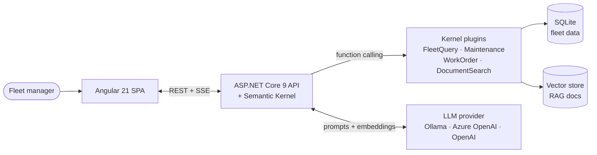

# FleetWise AI

[](https://github.com/steven-brett-edwards/fleetwise-ai/actions/workflows/ci.yml)

> An AI-powered fleet maintenance assistant built with Angular, .NET, and Microsoft Semantic Kernel


<!--
To record the GIF: open the app at http://localhost:4200/chat and capture
~15 seconds of a streamed response with a tool like LICEcap, Kap, or
`ffmpeg`. Save it as `docs/screenshots/chat-demo.gif` and it will render
above.
-->

## What is This?

FleetWise AI is a full-stack web application that helps fleet managers interact with their fleet data using natural language. It combines a traditional Angular + .NET application with Microsoft's Semantic Kernel to create an intelligent assistant that can query live fleet data and reference maintenance documentation.

A fleet manager can ask questions like:

- "Which vehicles are overdue for oil changes?"
- "What's the recommended brake inspection interval for a 2020 Ford F-150 with 60,000 miles?"
- "Show me all critical work orders"
- "Which vehicles have the highest lifetime maintenance costs?"

The AI answers these questions by querying a real database through Semantic Kernel function calling plugins and retrieving relevant fleet management documentation (maintenance procedures, safety policies, SOPs) through RAG (Retrieval-Augmented Generation) with vector embeddings.

## Architecture



A chat prompt travels from the Angular SPA to `/api/chat/stream`, where the orchestration service hands it to Semantic Kernel. SK asks the LLM what to do, the LLM picks plugins to call, those plugins hit the database or vector store, results round-trip back through SK, and the final answer streams to the browser over server-sent events.

## Tech Stack

| Layer            | Technology                                       |
| ---------------- | ------------------------------------------------ |
| Frontend         | Angular 21, TypeScript, Angular Material         |
| Backend          | ASP.NET Core, .NET 9, Entity Framework Core      |
| AI Orchestration | Microsoft Semantic Kernel 1.74.0                 |
| AI Abstractions  | Microsoft.Extensions.AI (IChatClient)            |
| Database         | SQLite (dev) / SQL Server (prod)                 |
| LLM              | Ollama (local), OpenAI (hosted demo), Groq / Azure OpenAI (optional) |
| Vector Store     | In-Memory (Semantic Kernel)                      |
| Observability    | .NET Aspire                                      |

## Status

This project is under active development.

- [x] .NET solution structure with clean architecture
- [x] Domain entities and EF Core data model (vehicles, work orders, maintenance, parts)
- [x] Seed data representing a realistic 35-vehicle municipal fleet
- [x] REST API with 9 endpoints
- [x] Angular frontend scaffold with Material, routing, and services
- [x] Semantic Kernel plugins with function calling (13 functions across 4 plugins)
- [x] Chat orchestration service with conversation history
- [x] Sync and streaming (SSE) chat endpoints
- [x] Provider-swap architecture (Ollama / Azure OpenAI / OpenAI via config)
- [x] RAG pipeline with fleet management documentation (vector embeddings + semantic search)
- [x] 89 unit tests with 100% coverage on all API components
- [x] Angular chat UI with SSE streaming responses
- [x] Dashboard with fleet summary, overdue/upcoming maintenance
- [x] Vehicle list and detail views with filtering
- [x] Work order list and detail views
- [x] Mobile responsive layout (sidenav, dashboard grid, chat bubbles, list filter bars)
- [x] Frontend unit tests (128 tests, 100% coverage on services + components)
- [x] CI/CD pipeline (GitHub Actions: parallel backend + frontend jobs with coverage)

## Running Locally

### Option 1 — Docker (fastest)

```bash
ollama serve &  # in another terminal, make sure the models are pulled
docker compose up --build
```

Open `http://localhost:4200`. The compose stack builds the API and frontend, points the API at the Ollama instance running on the host, and mounts a volume so the SQLite database survives container restarts.

If you **don't** have Ollama installed, use the full self-contained stack — it runs Ollama in a container too and pulls the models on first boot (~5 GB, cached afterwards):

```bash
docker compose -f docker-compose.yml -f docker-compose.full.yml up --build
```

### Option 2 — Native toolchains

#### Prerequisites

- [.NET 9 SDK](https://dotnet.microsoft.com/download/dotnet/9.0)
- [Node.js 22+](https://nodejs.org/) (`.nvmrc` pins to 22)
- [Ollama](https://ollama.com/) with a chat model pulled (e.g. `ollama pull qwen2.5:7b`)

#### Backend

```bash
cd src/FleetWise.Api
dotnet run
```

The API starts at `http://localhost:5100`. On first run, EF Core automatically creates and seeds the SQLite database with a 35-vehicle municipal fleet.

#### Frontend

```bash
cd src/fleetwise-client
npm install
npx ng serve
```

The Angular app starts at `http://localhost:4200` and proxies API requests to the backend.

#### Ollama

Make sure Ollama is running (`ollama serve`) with both a chat model and an embedding model pulled:

```bash
ollama pull qwen2.5:7b        # chat model (tool calling)
ollama pull nomic-embed-text  # embedding model (for RAG document search)
```

The app defaults to `qwen2.5:7b` for chat and `nomic-embed-text` (768 dimensions) for embeddings. To use a different provider (Azure OpenAI, OpenAI), set `AiProvider` and the corresponding section in `appsettings.json`.

## Deploying to Render

The repo ships with a [`render.yaml`](./render.yaml) blueprint that stands up
the full stack on [Render](https://render.com/)'s free tier using
[OpenAI](https://platform.openai.com/) for chat (`gpt-4o-mini`) and
embeddings (`text-embedding-3-small`). The full RAG pipeline is live in the
hosted demo — the DocumentSearch plugin indexes the fleet SOPs at startup
and the chat will cite them when you ask a policy question.

### Prerequisites

1. A [Render account](https://render.com/) — GitHub OAuth, no credit card.
2. An [OpenAI API key](https://platform.openai.com/api-keys). OpenAI requires
   a payment method on file, but usage for this demo is trivial:
   `gpt-4o-mini` is $0.15 / $0.60 per million input/output tokens and the
   embedding pass is a one-shot at startup. Set a monthly hard cap under
   **Settings → Limits** (e.g. $5) as a safety net.

### Deploy

1. Fork or push this repo to your GitHub account.
2. In Render, **New → Blueprint**, point it at the repo, pick the `main` branch.
3. Render reads `render.yaml` and provisions two services: `fleetwise-api`
   (Docker) and `fleetwise-frontend` (static site).
4. After the first build, open the `fleetwise-api` service → **Environment**
   and paste your OpenAI API key into `OpenAI__ApiKey`. Trigger a manual
   redeploy so the key takes effect.
5. Open the frontend URL — the SPA calls the API at its absolute Render URL
   with CORS enabled on the API side.

Free-tier web services sleep after 15 minutes of inactivity, so the first
request after a quiet period takes ~30s to cold-start. SQLite data is
reseeded from `SeedData.Initialize` on each boot — perfect for a demo,
not for state that needs to survive a restart.

The `Groq` provider is still wired up in `Program.cs` if you want a
no-credit-card fallback (fast, free, but no embeddings so RAG is disabled).
To use it, flip `AiProvider` in `render.yaml` to `Groq` and swap the
`OpenAI__*` env vars for `Groq__*`.

## Coming Next

**Python edition.** A parallel rewrite using FastAPI, LangGraph, and Anthropic Claude is in progress as a separate repository.

**Production polish.** Integration tests, error handling, and deployment configuration.

## License

This project is a portfolio demonstration and is not intended for production use.
